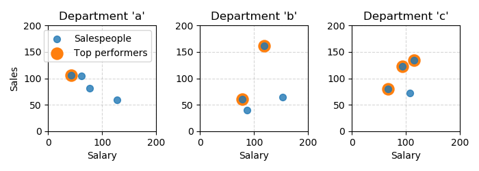

# skyline [](https://travis-ci.com/tommyod/skyline) [](https://pypi.org/project/skyline/)[](https://pepy.tech/project/skyline) [](https://github.com/ambv/black)

Skyline operator/query for computing the Pareto (non-dominated) frontier.

The apriori algorithm uncovers hidden structures in categorical data.
The classical example is a database containing purchases from a supermarket.
Every purchase has a number of items associated with it.
We would like to uncover association rules such as `{bread, eggs} -> {bacon}` from the data.
This is the goal of [association rule learning](https://en.wikipedia.org/wiki/Association_rule_learning), and the [Apriori algorithm](https://en.wikipedia.org/wiki/Apriori_algorithm) is arguably the most famous algorithm for this problem.
This repository contains an efficient, well-tested implementation of the apriori algorithm as descriped in the [original paper](https://www.macs.hw.ac.uk/~dwcorne/Teaching/agrawal94fast.pdf) by Agrawal et al, published in 1994.

## Examples - Skyline queries for data analysis and insight

Suppose you are going on holiday and you are looking for a hotel that is cheap and close to the beach. 
These two goals are complementary as the hotels near the beach tend to be more expensive. 

The database system at your travel agents' is unable to decide which hotel is best for you, but it can at least present you all interesting hotels. 
Interesting are all hotels that are not worse than any other hotel in both dimensions. 
We call this set of interesting hotels the *skyline*. 
From the skyline, you can now your final decision, thereby weighing your personal preferences for price and distance to the beach.

```python
from skyline import skyline
import pandas as pd

hotels = pd.DataFrame({"price": [50, 53, 62, 87, 83, 39, 60, 44], 
                       "distance_to_beach": [13, 21, 19, 13, 5, 22, 22, 25]})
mask = skyline(hotels, sense=["min", "min"])
skyline_hotels = hotels[mask]
```

[]


```python
from skyline import skyline
import pandas as pd

salespeople = pd.DataFrame(
    {
        "salary": [94, 107, 67, 87, 153, 62, 43, 115, 78, 77, 119, 127],
        "sales": [123, 72, 80, 40, 64, 104, 106, 135, 61, 81, 162, 60],
        "department": ["c", "c", "c", "b", "b", "a", "a", "c", "b", "a", "b", "a"],
    }
)
mask = skyline(salespeople, sense=["min", "max", "diff"])
top_performers = salespeople[mask]
```

[]


More examples are included below.

## Installation

The software is available through GitHub, and through [PyPI](https://pypi.org/project/skyline/).
You may install the software using `pip`.

```bash
pip install skyline
```

## Contributing

You are very welcome to scrutinize the code and make pull requests if you have suggestions and improvements.
Your submitted code must be PEP8 compliant, and all tests must pass.

## Performance

